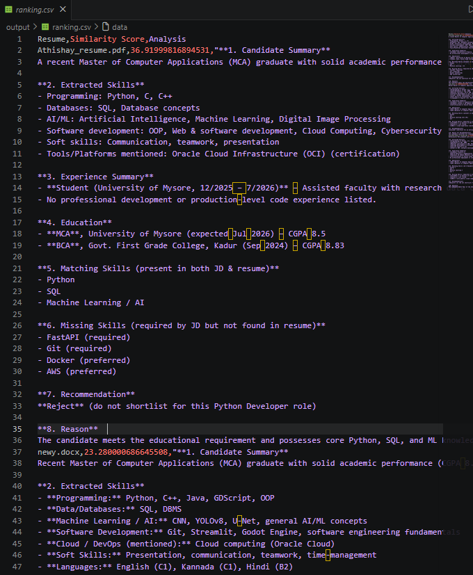
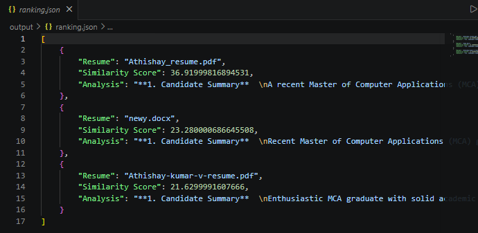
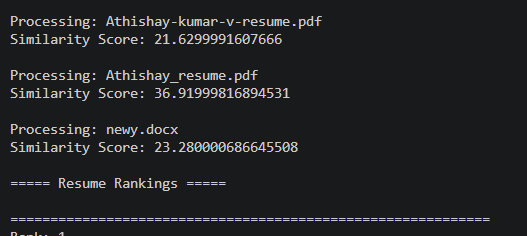
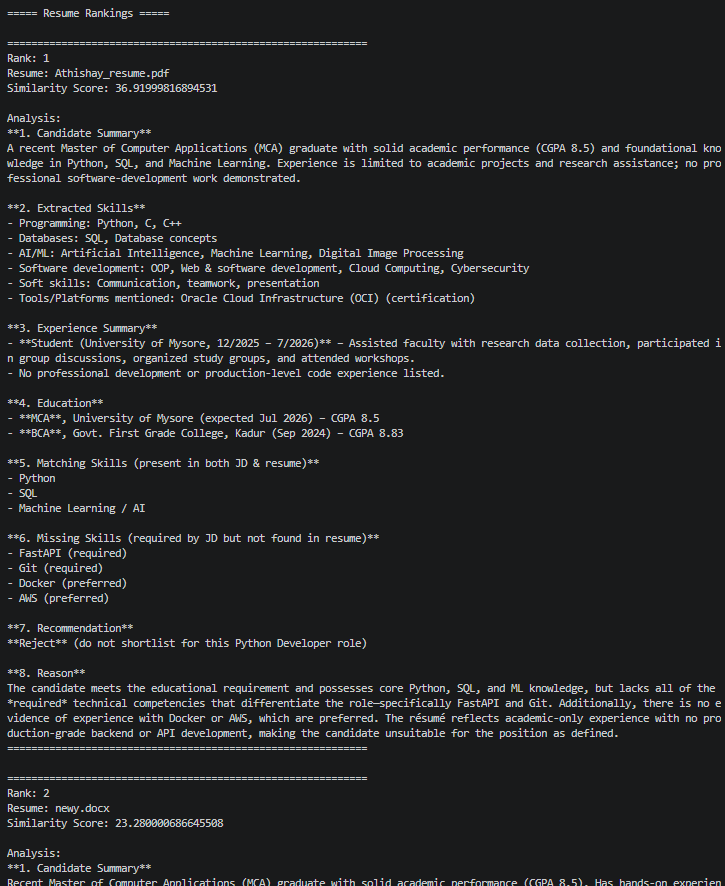

# Resume Screening Agent

## Overview

The Resume Screening Agent is an AI-powered application that automatically evaluates and ranks multiple resumes against a given Job Description (JD). It uses semantic similarity to measure how well each resume matches the job requirements and leverages the Groq LLM to generate a concise analysis and hiring recommendation.

The application supports multiple resume formats, processes all resumes in a folder, ranks candidates based on relevance, and exports the results in CSV and JSON formats.

---

## Features

- Parse resumes in PDF, DOCX, and TXT formats
- Read a Job Description from a text file
- Compute semantic similarity using Sentence Transformers
- Generate AI-based resume analysis using the Groq LLM
- Rank candidates based on similarity score
- Process multiple resumes in a single run
- Export ranked results to CSV and JSON

---

## Project Structure

```
resume_agent/
│
├── data/
│   └── job_description.txt
│
├── resumes/
│   ├── resume1.pdf
│   ├── resume2.docx
│   └── resume3.txt
│
├── output/
│   ├── ranking.csv
│   └── ranking.json
│
├── parser.py
├── similarity.py
├── llm.py
├── app.py
├── requirements.txt
├── .env
└── README.md
```

---

## Technologies Used

- Python 3.x
- Groq API
- Sentence Transformers (`all-MiniLM-L6-v2`)
- Scikit-learn
- PyMuPDF
- python-docx
- Pandas
- python-dotenv

---

## Installation

### 1. Clone the repository

```bash
git clone https://github.com/<your-username>/resume-screening-agent.git

cd resume-screening-agent
```

### 2. Create a virtual environment

Windows

```bash
python -m venv agnt
agnt\Scripts\activate
```

Linux / macOS

```bash
python3 -m venv agnt
source agnt/bin/activate
```

### 3. Install dependencies

```bash
pip install -r requirements.txt
```

---

## Configure the Groq API Key

Create a `.env` file in the project root.

```
GROQ_API_KEY=your_groq_api_key
```

---

## Preparing the Input

### Job Description

Place the Job Description inside:

```
data/job_description.txt
```

Example:

```
Python Developer

Required Skills:
- Python
- SQL
- Machine Learning
- FastAPI
- Git

Preferred:
- Docker
- AWS
```

---

### Resume Folder

Place all resumes inside the `resumes` folder.

Supported formats:

- PDF
- DOCX
- TXT

Example:

```
resumes/
    candidate1.pdf
    candidate2.pdf
    candidate3.docx
```

The application can process multiple resumes in a single execution.

---

## Running the Application

Execute:

```bash
python app.py
```

The application will:

1. Read the Job Description.
2. Read every resume in the `resumes` folder.
3. Extract resume text.
4. Compute semantic similarity.
5. Generate AI analysis using Groq.
6. Rank all candidates.
7. Save the results.

---

## Output

After execution, the following files are created inside the `output` folder.

### ranking.csv

Contains:

- Resume Name
- Similarity Score
- AI Analysis



### ranking.json

Contains the same information in JSON format.


---

## Scoring Method

The candidate ranking is based on semantic similarity between the resume and the Job Description.

The process is:

1. Resume text is extracted from PDF, DOCX, or TXT files.
2. The Job Description is read from a text file.
3. Sentence Transformer (`all-MiniLM-L6-v2`) converts both texts into embeddings.
4. Cosine similarity is computed to obtain a relevance score.
5. The Groq LLM analyzes each resume and provides:
   - Candidate Summary
   - Extracted Skills
   - Experience Summary
   - Education
   - Matching Skills
   - Missing Skills
   - Recommendation
   - Reasoning
6. Candidates are ranked in descending order of similarity score.

---

## Sample Output

```
Rank: 1

Resume:
candidate2.pdf

Similarity Score:
89.42

Recommendation:
Shortlist

Reason:
Strong Python, SQL, and Machine Learning experience with relevant academic projects.
```




---
## Tradeoff Notes and Reasoning

### 1. Semantic Similarity over Fine-Tuned Models
I used the `all-MiniLM-L6-v2` Sentence Transformer model with cosine similarity to compute resume relevance. This approach is lightweight, fast, and does not require training a custom model. A fine-tuned resume-ranking model could improve accuracy but would require additional training data and development time.

### 2. LLM for Resume Analysis
The Groq LLM is used to generate candidate summaries, extract skills, summarize experience and education, identify matching and missing skills, and provide hiring recommendations. This simplifies the implementation while producing human-readable explanations.

### 3. Text Extraction
The application extracts text from PDF, DOCX, and TXT resumes using PyMuPDF and python-docx. This keeps the solution simple and reliable for digital resumes. Scanned PDFs requiring OCR are not supported.

### 4. Ranking Strategy
Candidates are ranked using the semantic similarity score between the resume and the job description. The LLM provides qualitative reasoning but does not influence the ranking score. This makes the ranking transparent and reproducible.

### 5. Simplicity over Complexity
The project was designed as a modular, easy-to-understand solution suitable for a 24-hour implementation. The focus was on delivering a complete, working pipeline rather than adding advanced ATS features.


## Future Improvements

- OCR support for scanned resumes
- Web-based user interface
- Database integration
- Resume skill extraction using Named Entity Recognition (NER)
- ATS score visualization
- Support for additional resume formats

---

## Author

**Athishay Kumar V**

Python | Machine Learning | AI | NLP
